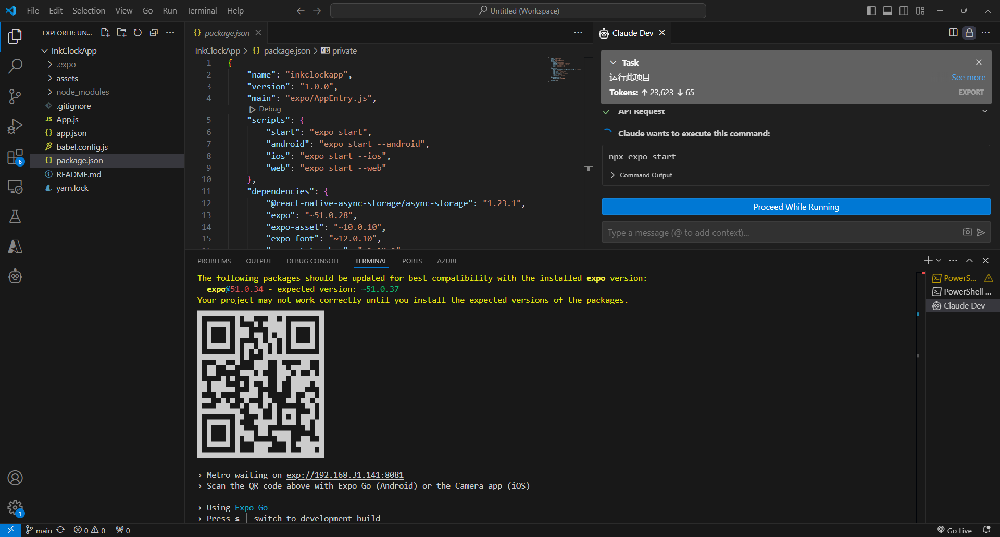

# InkClockApp

This is the InkClockApp project.

这是 InkClockApp 项目。

## Getting Started

### Prerequisites

- Node.js (version 14 or later)
- Yarn package manager
- Expo CLI

### 安装要求

- Node.js（版本 14 或更高）
- Yarn 包管理器
- Expo CLI

### Installation

1. Clone the repository:

    ```sh
    git clone https://github.com/yourusername/InkClockApp.git
    cd InkClockApp
    ```

2. Install the dependencies:

    ```sh
    yarn install
    ```

3. Start the project:

    ```sh
    npx expo start
    ```

### 安装步骤

1. 克隆仓库：

    ```sh
    git clone https://github.com/yourusername/InkClockApp.git
    cd InkClockApp
    ```

2. 安装依赖：

    ```sh
    yarn install
    ```

3. 启动项目：

    ```sh
    npx expo start
    ```

### Running on Different Platforms

- To run on an Android device/emulator:

    ```sh
    npx expo start --android
    ```

- To run on an iOS device/simulator:

    ```sh
    npx expo start --ios
    ```

- To run on the web:

    ```sh
    npx expo start --web
    ```

### 在不同平台上运行

- 在 Android 设备/模拟器上运行：

    ```sh
    npx expo start --android
    ```

- 在 iOS 设备/模拟器上运行：

    ```sh
    npx expo start --ios
    ```

- 在 Web 上运行：

    ```sh
    npx expo start --web
    ```

### Troubleshooting

If you encounter any issues, make sure you have the correct versions of Node.js and Yarn installed. You can also refer to the Expo documentation for more detailed troubleshooting steps.

### 故障排除

如果遇到任何问题，请确保安装了正确版本的 Node.js 和 Yarn。您也可以参考 Expo 文档以获取更详细的故障排除步骤。

### References

- [Expo Documentation](https://docs.expo.dev/)
- [React Native Documentation](https://reactnative.dev/docs/getting-started)
- [Yarn Package Manager](https://yarnpkg.com/getting-started)

### 参考资料

- [Expo 文档](https://docs.expo.dev/)
- [React Native 文档](https://reactnative.dev/docs/getting-started)
- [Yarn 包管理器](https://yarnpkg.com/getting-started)


